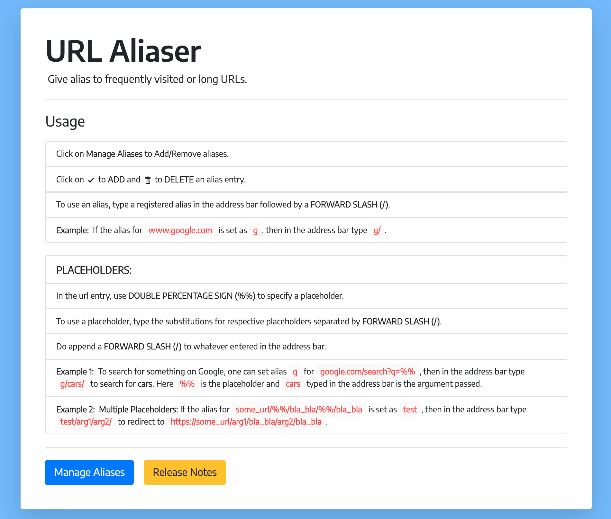

# URL Aliaser

A Chrome Extension which gives alias to website URLs.

_Click on the icon below to download:_ \

Bored of typing those long URLs again and again? Get rid of it with this extension. Add aliases for frequently visited websites and save time!

After adding the extension to Google Chrome, navigate to 'Options' after clicking the URL Aliaser icon right near the address bar for the usage instructions and managing aliases.

## Features

* Support for multiple placeholders for easier navigation.
* Sync with Google Account to use on all signed-in devices.

## Screenshot (+Usage)

## Built With

* [jQuery](https://api.jquery.com/)
* Javascript
* HTML and CSS

## Author

* [**ShivanshRakesh**](https://github.com/ShivanshRakesh)

## Contributing
Pull requests are welcomed. For major changes, please open an issue first to discuss what you would like to change.
